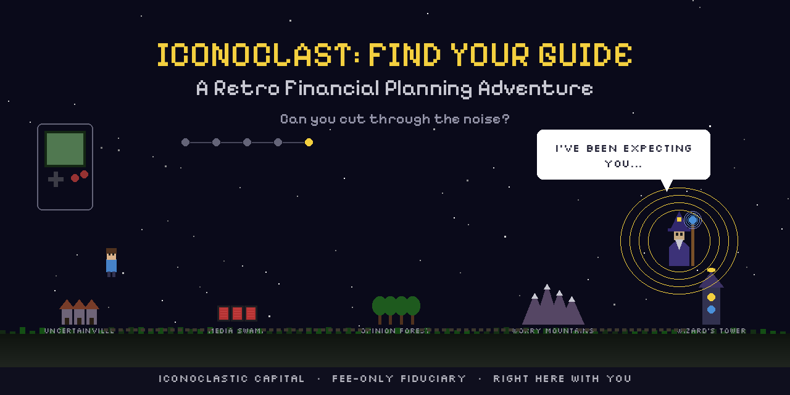

# 🎮 Iconoclast: Find Your Guide

**A retro RPG that turns financial planning into an adventure.**



> *You don't need another spreadsheet. You need a guide.*

---

## 🕹️ Play Now

**[▶ Play Iconoclast: Find Your Guide](https://iconocapital.github.io/iconoclast-game/)**

Works on desktop and mobile. No download required. 5-10 minutes to play.

---

## What Is This?

**Iconoclast: Find Your Guide** is a browser-based retro RPG built by [Iconoclastic Capital](https://iconocapital.com) — a fee-only fiduciary financial planning firm based in New York.

Instead of boring brochures, we made a game. Because if financial advice is going to be different, the way you discover it should be too.

You play as someone navigating the real obstacles between you and financial clarity:

| Zone | What You Face |
|------|--------------|
| 🏘️ **Uncertainville** | The overwhelm of not knowing where to start |
| 📺 **Media Swamp** | Scary headlines designed to make you panic |
| 🌲 **Opinion Forest** | Everyone's unsolicited financial advice |
| ⛰️ **Worry Mountains** | Your own doubts and fears about money |
| 🧙 **The Iconoclastic Guide** | The clarity you've been looking for |

At the end, you meet The Iconoclastic Guide — a wizard who actually listens, reflects your journey back to you, and asks what *you* need. No sales pitch. Just a real conversation.

---

## Why a Game?

Most people avoid financial planning because it feels intimidating, confusing, or boring. We wanted to flip that.

**Iconoclast: Find Your Guide** uses interactive storytelling and behavioral finance concepts to help people recognize the real barriers to getting financial help — and realize they don't have to face them alone.

It's also a playable demonstration of what makes Iconoclastic Capital different:

- **Fee-only** — no commissions, no kickbacks, no conflicts of interest
- **Fiduciary** — legally required to put your interests first
- **Human** — we talk like real people, not compliance robots

---

## Features

- 🎮 **Gameboy-style pixel art** — hand-coded retro aesthetic, no sprites ripped
- 🎵 **Chiptune soundtrack** — procedurally generated music unique to each zone
- 🧠 **Behavioral finance quiz** — personalized responses based on your answers
- 🧙 **Interactive wizard encounter** — The Iconoclastic Guide reflects your journey
- 📱 **Mobile-friendly** — touch D-pad controls + responsive canvas
- ⚡ **Zero dependencies** — pure HTML5 Canvas + Web Audio API in a single file
- 🔒 **No tracking, no cookies** — just a game

---

## Tech Stack

This entire game is a single `index.html` file. No frameworks, no build step, no npm install.

- **Rendering**: HTML5 Canvas (480×480 internal, scaled to viewport)
- **Audio**: Web Audio API — all sound generated programmatically
- **Fonts**: [Press Start 2P](https://fonts.google.com/specimen/Press+Start+2P) via Google Fonts
- **Hosting**: GitHub Pages
- **Size**: ~45KB total

---

## About Iconoclastic Capital

[Iconoclastic Capital](https://iconocapital.com) is a fee-only fiduciary financial planning and investment management firm. We provide comprehensive financial planning, retirement planning, tax strategy, insurance analysis, and portfolio management for individuals and families.

**We challenge the way financial advice is given.** No commissions. No product sales. No hidden fees. Just planning that puts you first.

📍 Based in New York · Serving clients nationally

### Our Services

- Comprehensive financial planning
- Retirement planning and projections
- Investment management
- Tax planning and strategy
- Insurance and risk analysis
- Estate planning coordination

**[Get Started →](https://iconocapital.com/get-started)**

---

## For Developers

Want to embed this on your own site? Drop the iframe:

```html
<iframe 
  src="https://iconocapital.github.io/iconoclast-game/" 
  width="800" 
  height="900" 
  style="border: none; border-radius: 12px;"
  title="Iconoclast: Find Your Guide — Financial Planning Game"
></iframe>
```

---

## Keywords

`financial planning game` · `fee-only financial advisor` · `fiduciary financial planner` · `retro RPG` · `behavioral finance` · `financial advisor New York` · `interactive financial planning` · `Iconoclastic Capital` · `fee-only fiduciary`

---

<p align="center">
  <strong>Built by <a href="https://iconocapital.com">Iconoclastic Capital</a></strong><br>
  <em>Right here with you.</em>
</p>
